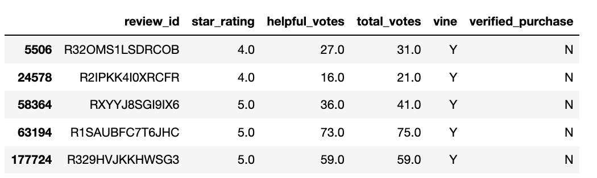
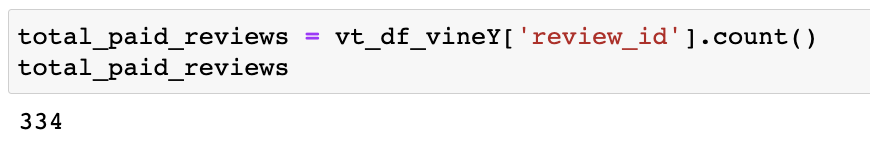
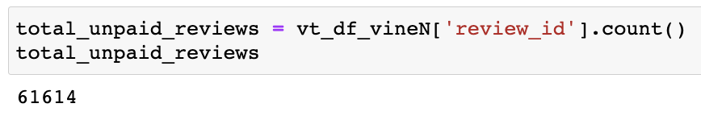
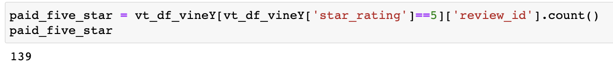
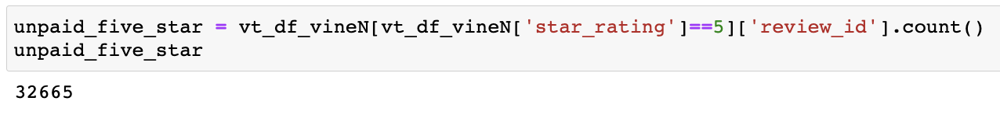
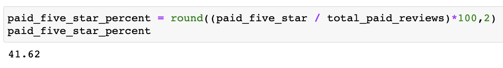
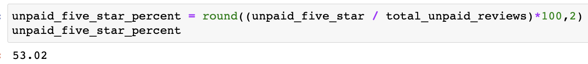

# Amazon_Vine_Analysis
## Overview
### Purpose
Following my initial successful work with Jennifer on the SellBy project, I've been tasked with another, larger project: analyzing Amazon reviews written by members of the paid Amazon Vine program. The Amazon Vine program is a service that allows manufacturers and publishers to receive reviews for their products. Companies like SellBy pay a small fee to Amazon and provide products to Amazon Vine members, who are then required to publish a review.

In this project, I accessed a dataset of Sports products and used PySpark to perform the ETL process to extract the dataset, transform the data, connect to an AWS RDS instance, and load the transformed data into pgAdmin. Then, I used Pandas and Jupyter Notebook to determine if there is any bias toward favorable reviews from Vine members in your dataset. Then, you’ll write a summary of the analysis for Jennifer to submit to the SellBy stakeholders.

## Results

### Vine DataFrame

### Non-Vine DataFrame

## Vine vs Non-Vine Reviews

### Vine

### Non-Vine

- Vine Reviews: 334
- Non-Vine Reviews: 61,614

## 5-Star Reviews

### Vine

### Non-Vine

- Vine 5-Star Reviews: 139
- Non-Vine 5-Star Reviews: 32,665

## Percentage of 5-Star Reviews

### Vine

### Non-Vine

- Vine 5-Star Review %: 41.62%
- Non-Vine 5-Star Review %: 53.02%

## Summary
Of the 334 reviews that were a part of the Vine program, 41.6% of the products (139 total) were given a five star review while 53% of the reviews that weren't paid for through the Vine program received five stars. Given the over 10% difference in five-star reviews between paid for and non-paid for reviews, we can see there isn't a lot of positivity bias from this Vine community. In fact, one can confer from the smaller rate of 5-star reviews that the members of the Vine program are harsher on the products, maybe through their own self-awareness that they are being paid to review products rather than providing a review based off of a personal purchase. 

One way to confirm our assumption of a lack of positivity bias is to include all reviews, including the ones that had less than 20 votes. This would give us a larger sample size to work with and could potential narrow the difference between reviews that were paid for and not paid for. 